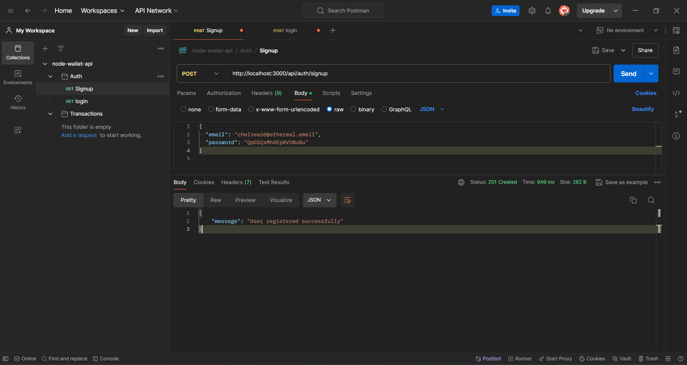
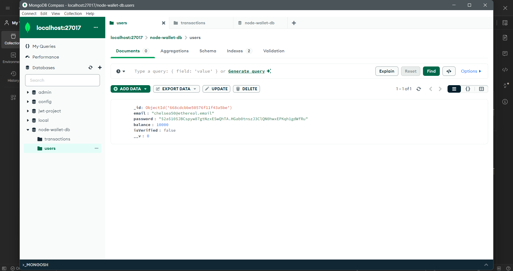
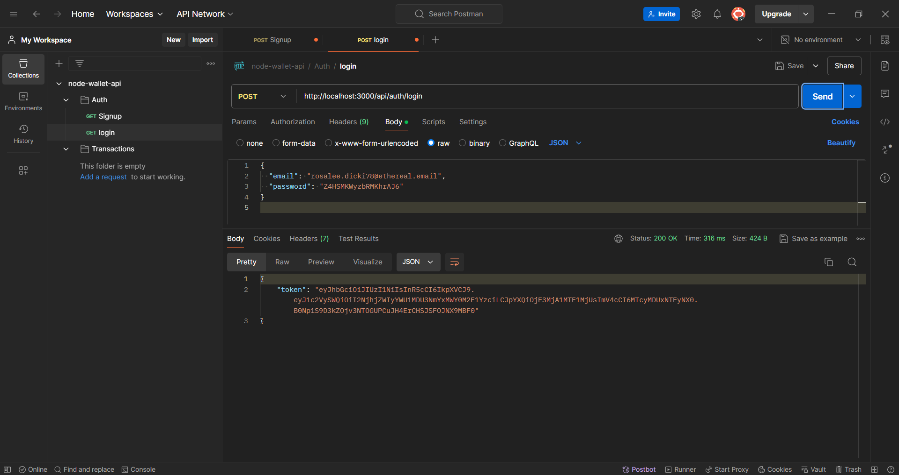
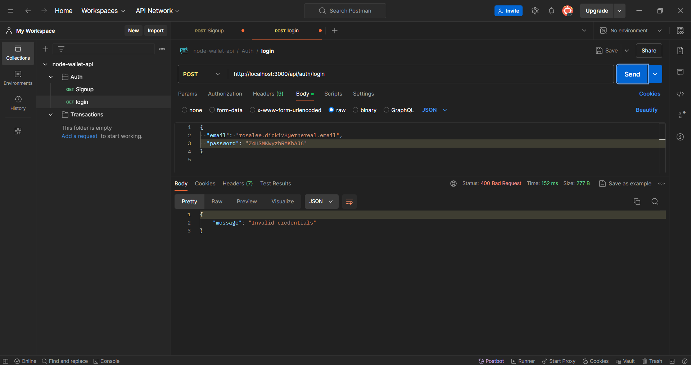
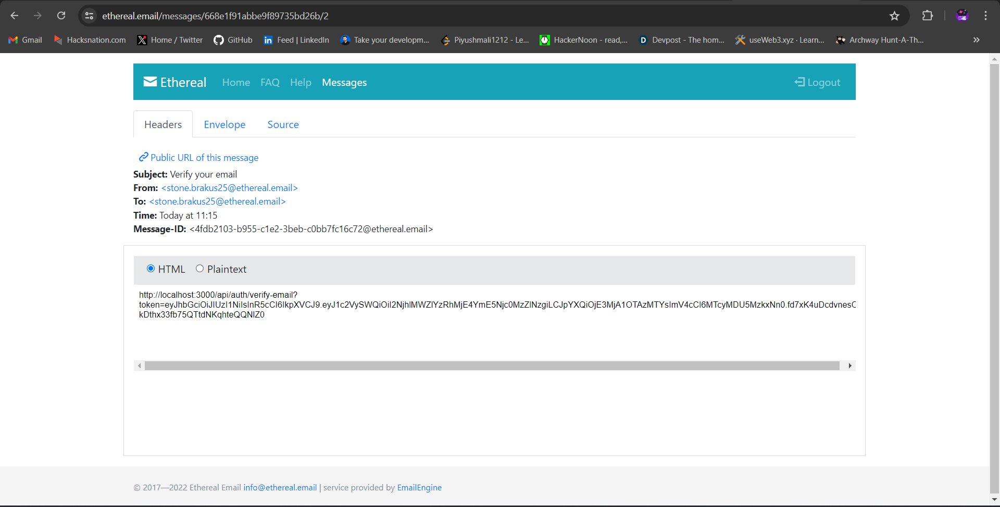
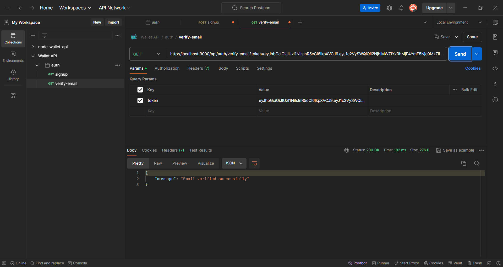
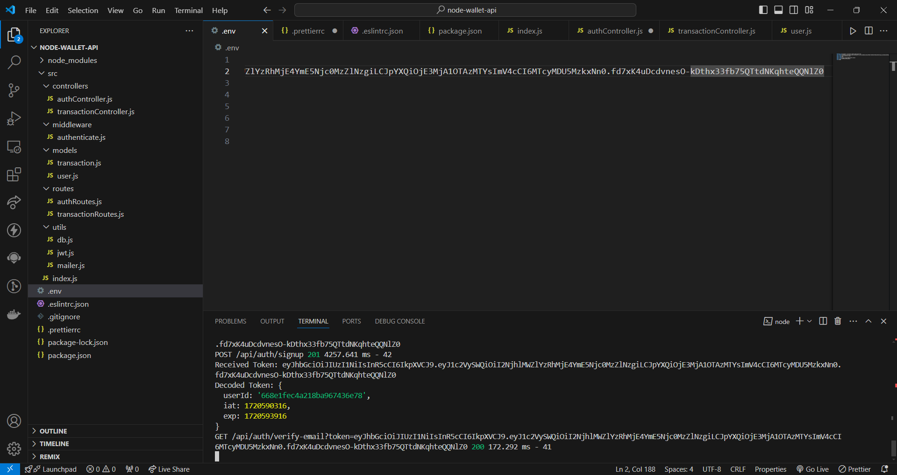
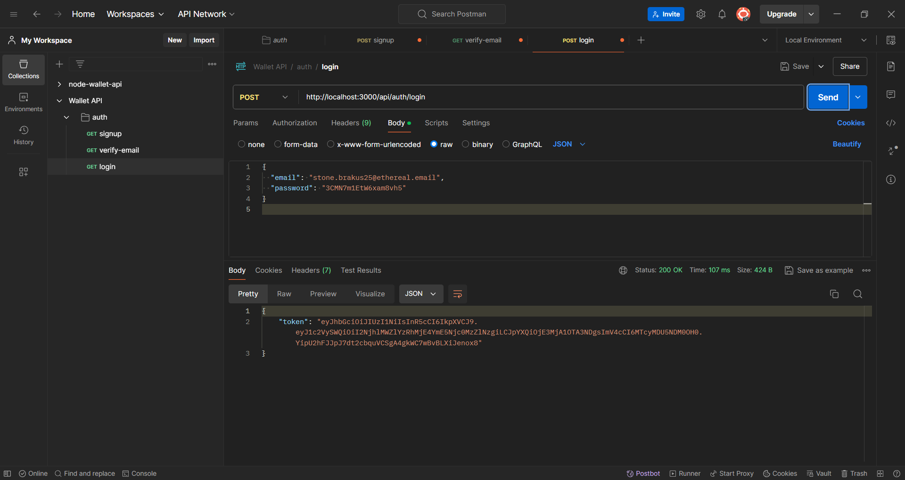
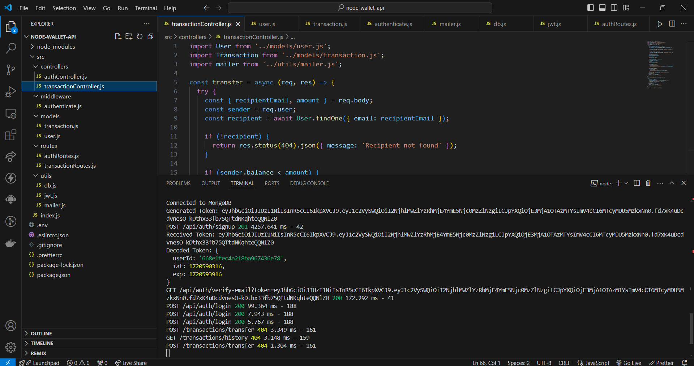

# Node.js Wallet API

This project implements a RESTful API for a wallet system using Node.js, Express.js, MongoDB, and JWT for authentication. Below is a detailed guide on how each feature is implemented.

## Features Implemented

### 1. Setup and Dependencies

- Ensure Node.js and MongoDB are installed on your machine.
- Install project dependencies using npm:

  ```bash
  npm install
  ```

### 2. Environment Variables

Create a `.env` file in the root directory with the following variables:

```dotenv
MONGODB_URI=mongodb://localhost:27017/node-wallet-api
JWT_SECRET=your_jwt_secret
EMAIL_HOST=smtp.example.com
EMAIL_PORT=587
EMAIL_USER=your_email@example.com
EMAIL_PASS=your_email_password
PORT=3000
```

### 3. Code Structure and Standards

- Code strictly follows ES6 standards.
- ESLint and Prettier are configured for code linting and formatting.

### 4. User Session Management

- **JWT Token**: JWT tokens are used for user authentication and authorization.
  - Tokens are generated on successful login or signup.
  - Middleware `authenticate` verifies tokens on protected routes.

### 5. Email Verification

- **Signup**: Sends a verification email to the user upon registration.
  - Uses Nodemailer to send the email with a verification link.
  - Endpoint: `POST /api/auth/signup`

### 6. Authentication

- **Login**: Supports login using password or OTP (One-Time Password).
  - Password-based login uses bcrypt for password hashing and comparison.
  - OTP logic can be extended as per application requirements.
  - Endpoint: `POST /api/auth/login`

### 7. Initial Balance on Signup

- Users receive a predefined fake balance upon successful registration.
  - Balance is stored in the user's document in MongoDB.

### 8. Transfer Functionality

- **Transfer Funds**: Allows users to transfer funds to other users.
  - Validates sender's balance before proceeding with the transfer.
  - Updates sender and recipient balances in the database.
  - Endpoint: `POST /api/transactions/transfer`

### 9. Transaction Details

- **History**: Retrieves transaction history for a user.
  - Users and admins can view transaction details.
  - Transactions are stored in MongoDB with sender, recipient, amount, and timestamp.

### 10. Email Notifications

- **Transaction Notifications**: Sends email notifications to users for successful or failed transactions.
  - Uses Nodemailer to notify users about transaction outcomes.

### 11. Running the Application

- Start the server using:

  ```bash
  npm start
  ```

- The server will run on `http://localhost:3000` by default.

### 12. API Endpoints

- **Authentication**:
  - `POST /api/auth/signup`: User registration with email verification.
  - `GET /api/auth/verify-email`: Verify email after signup.
  - `POST /api/auth/login`: User login with password or OTP.

- **Transactions**:
  - `POST /api/transactions/transfer`: Transfer funds between users.
  - `GET /api/transactions/history`: Retrieve transaction history for the authenticated user.

### 13. Postman Setup

- Import the provided Postman collection for testing API endpoints.
- Configure environment variables like `baseUrl` and `token` for testing.

### 14. Error Handling

- Comprehensive error handling and logging for server-side errors.
- Responses include appropriate status codes and error messages.

### 15. Security Considerations

- Secure password hashing using bcrypt.
- JWT token expiration and validation.
- Input validation and sanitization to prevent common security vulnerabilities.


## Output Examples












