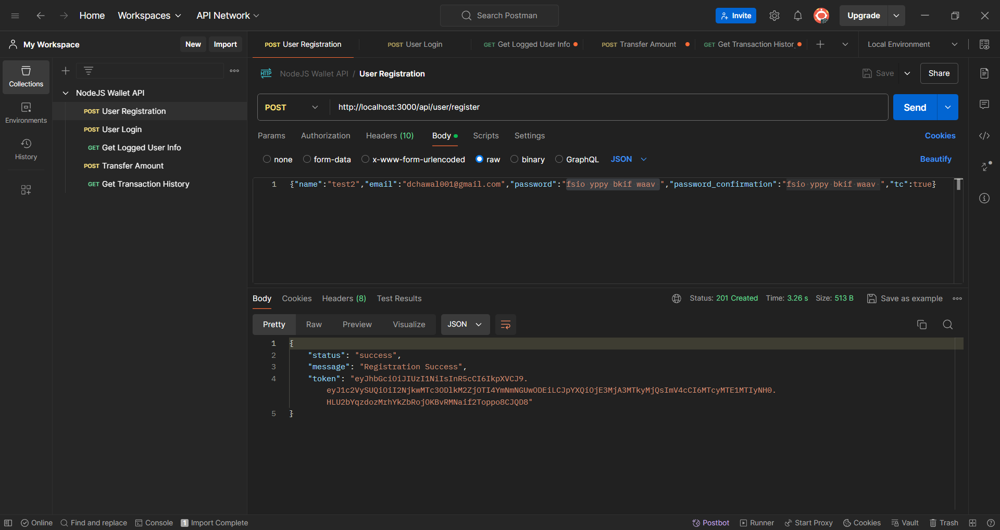
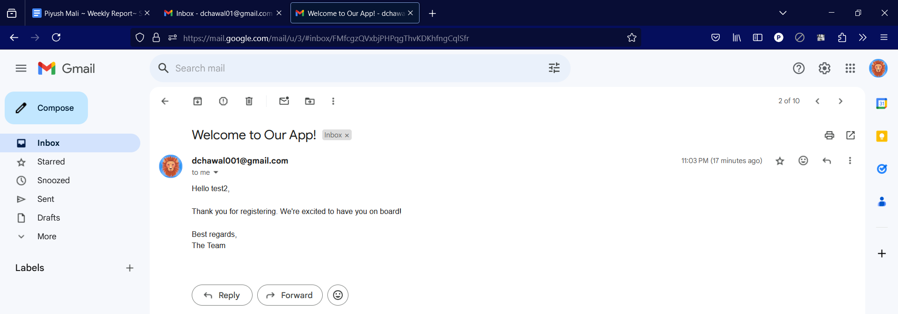
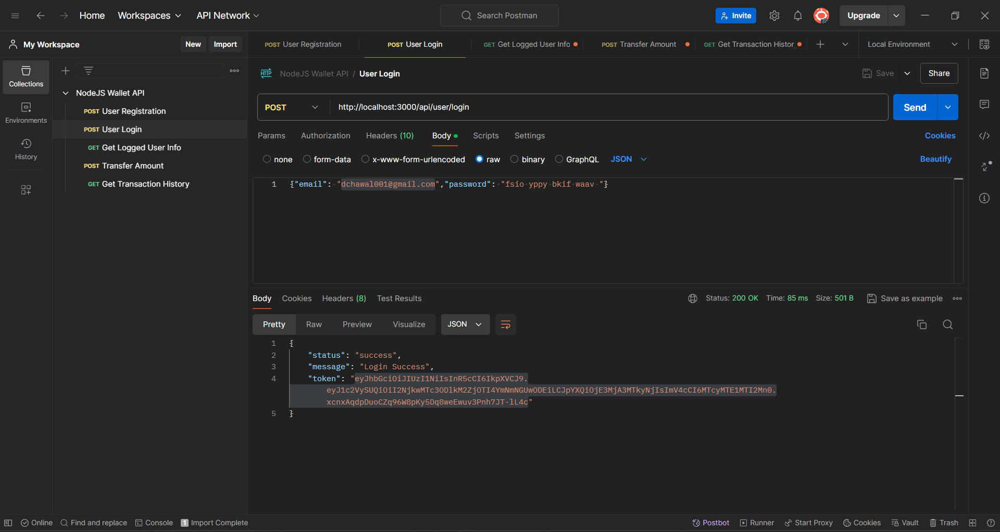
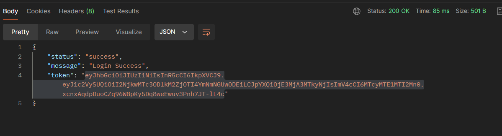
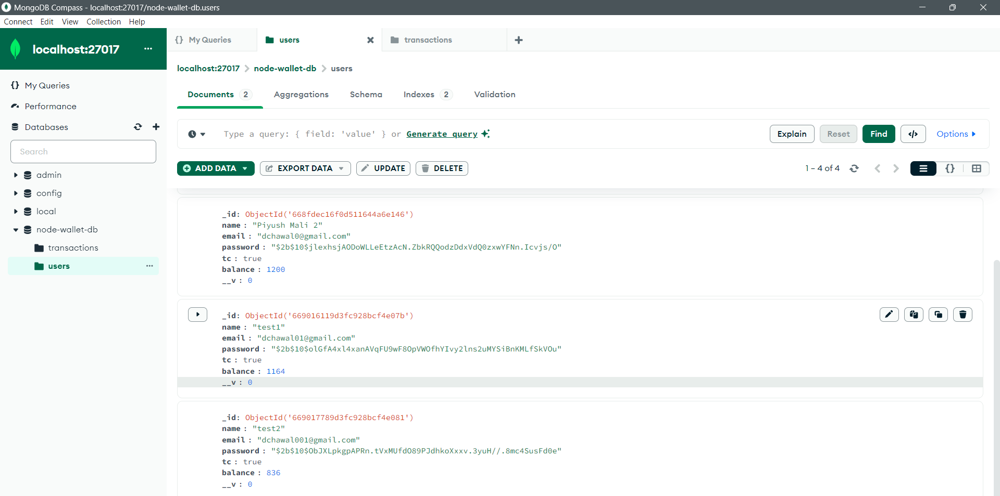
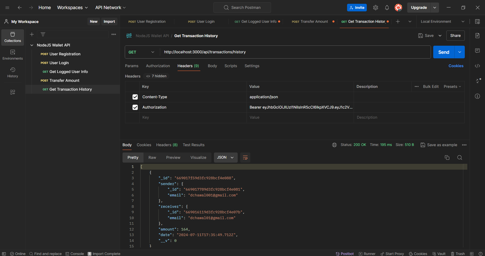
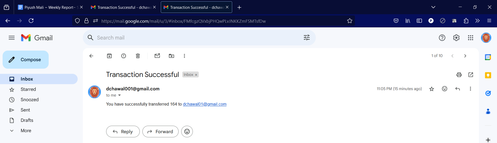

# Node Wallet API

This project is a Node.js-based Wallet API that handles user authentication, transactions, and email notifications. The code is strictly written in ES6 standards, using ESLint and Prettier for code quality and consistency.

## Features

- **Code Quality**: The project adheres to ES6 standards and utilizes ESLint and Prettier for maintaining code quality.
- **JWT Authentication**: User sessions are maintained using JSON Web Tokens (JWT).
- **Email Verification**: On user signup, a verification email is sent.
- **User Login**: Supports login with password and OTP.
- **Fake Balance**: New users are given a fake balance on signup.
- **Transaction Management**: Users can transfer funds to each other.
- **Transaction History**: Users and admins can view transaction details.
- **Email Notifications**: Users receive email notifications for transaction success or failure.

## Installation

1. **Clone the repository:**
    ```bash
    git clone https://github.com/yourusername/Node-Wallet-API.git
    cd Node-Wallet-API
    ```

2. **Install dependencies:**
    ```bash
    npm install
    ```

3. **Set up environment variables:**

    Create a `.env` file in the root directory with the following content:

    ```
    MONGODB_URI=mongodb://localhost:27017/node-wallet-db
    JWT_SECRET=your_jwt_secret
    EMAIL_HOST=smtp.example.com
    EMAIL_PORT=587
    EMAIL_USER=your_email@example.com
    EMAIL_PASS=your_email_password
    PORT=3000
    ```

4. **Run the server using nodemon:**
    ```bash
    npm start
    ```

## Usage

1. **User Registration:**
    - Users can register with their name, email, password, and terms and conditions agreement.
    - An email verification link is sent upon successful registration.

2. **User Login:**
    - Users can log in using their email and password.
    - The server responds with a JWT token for session management.

3. **Fake Balance on Signup:**
    - Each new user receives a default balance of 1000 units upon registration.

4. **Transaction Management:**
    - Users can transfer funds to other users by providing the recipient's email and the amount to transfer.
    - The system checks for sufficient balance and updates both users' balances accordingly.

5. **Transaction History:**
    - Users can view their transaction history.
    - Admins can view the transaction history of all users.

6. **Email Notifications:**
    - Users receive an email notification for successful and failed transactions.

## Postman Documentation

Explore the Node Wallet API endpoints and functionalities [## Postman Documentation

Explore the Node Wallet API endpoints and functionalities [here]([https://link-to-your-postman-documentation](https://documenter.getpostman.com/view/36718380/2sA3e5c7ss))].

## Output Images

Here are some output images demonstrating the functionality of the Node Wallet API:

1. **User Registration:**
   

2. **Email Verification:**
   

3. **User Login:**
   

4. **JWT Token Response:**
   

5. **Fake Balance on Signup:**
   

6. **Transfer Amount:**
   

7. **Transaction History:**
   

8. **Email Notification for Successful Transaction:**
   


## Contributing

Contributions are welcome! Please open an issue or submit a pull request for any improvements or bug fixes.


